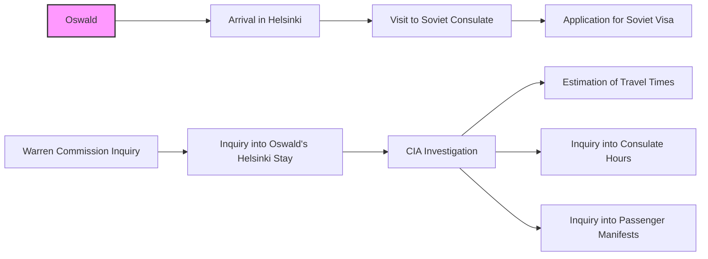

# Oswald in Helsinki, 1959

This directory contains documents specifically related to Lee Harvey Oswald's visit to Helsinki, Finland, in October 1959, shortly before his defection to the Soviet Union.  The focus is on his interactions with the Soviet Consulate and any related activities that might shed light on his intentions and connections.

## Mermaid Diagram

