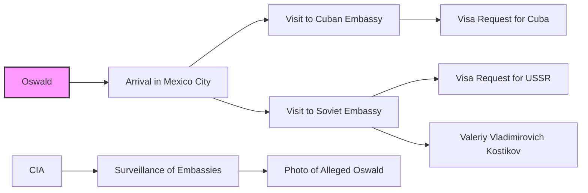

# Oswald in Mexico City, 1963

This directory contains documents related to Lee Harvey Oswald's visit to Mexico City in September-October 1963, shortly before the assassination of President Kennedy. The focus is on his interactions with the Cuban and Soviet Embassies, and any other activities that might shed light on his intentions and connections.

## Mermaid Diagram

