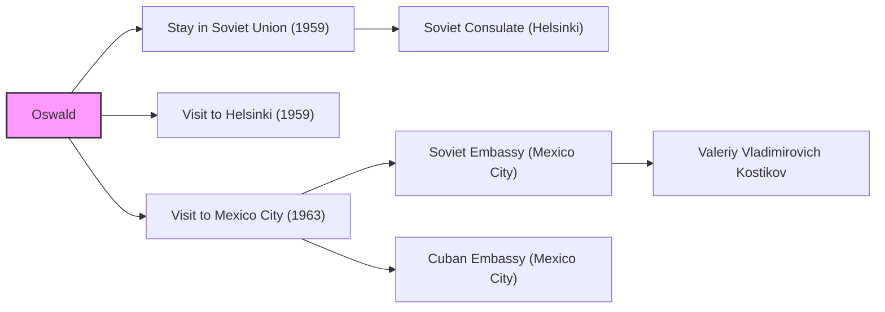

# Oswald's Activities and Connections

This directory focuses on documents related to Lee Harvey Oswald's background, movements, and contacts.  The primary focus is on his time in the Soviet Union, his activities in Mexico City, and any connections he may have had with intelligence agencies or individuals of interest.  The goal is to organize documents that shed light on Oswald's potential motivations, affiliations, and actions leading up to the assassination of President Kennedy.

## Mermaid Diagram

