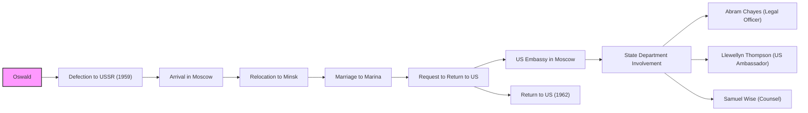

# Oswald in the USSR, 1959-1962

This directory contains documents related to Lee Harvey Oswald's time in the Soviet Union, from his defection in 1959 to his return to the United States in 1962.  The focus is on his activities, contacts, and any interactions with Soviet authorities or intelligence agencies.

## Mermaid Diagram

