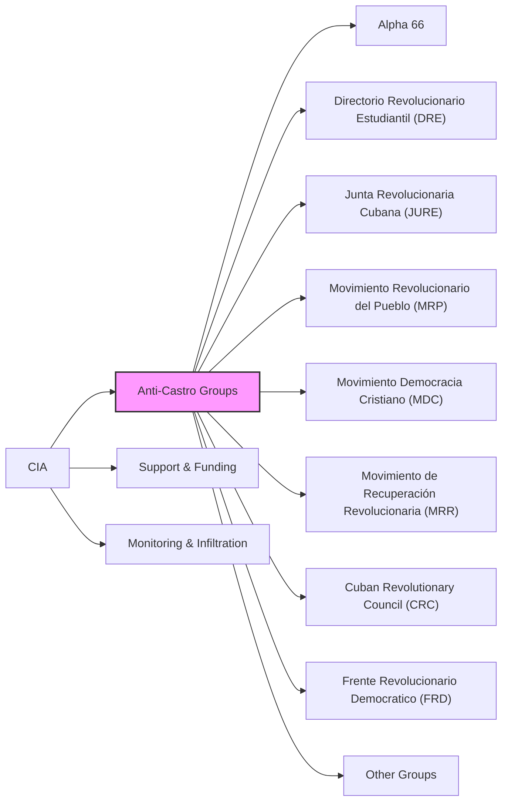

# Anti-Castro Groups

This directory contains documents related to various anti-Castro groups, their activities, and their interactions with the CIA. This includes support, monitoring, and potential infiltration of these groups.

## Mermaid Diagram

