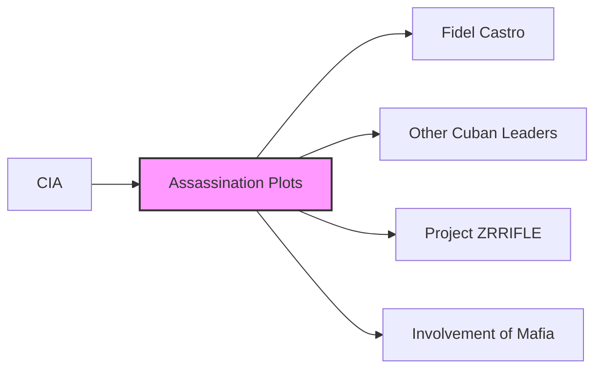

# Assassination Plots

This directory contains documents related to alleged CIA plots or discussions regarding the assassination of Fidel Castro and other Cuban leaders.

## Mermaid Diagram

```mermaid
graph LR
    CIA --> AssassinationPlots["Assassination Plots"]
    AssassinationPlots --> Castro["Fidel Castro"]
    AssassinationPlots --> OtherCubanLeaders["Other Cuban Leaders"]
    AssassinationPlots --> ZRRIFLE["Project ZRRIFLE"]
    AssassinationPlots --> Mafia["Involvement of Mafia"]
    style AssassinationPlots fill:#f9f,stroke:#333,stroke-width:2px
```

