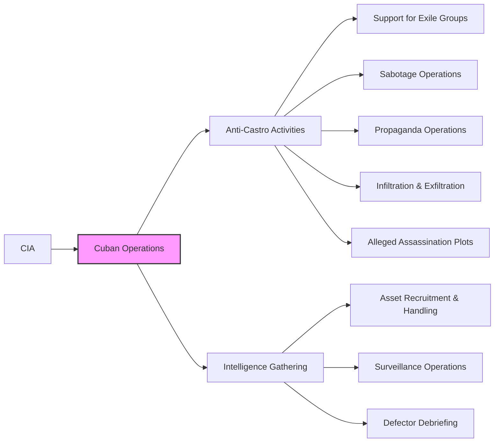

# Cuban Operations

This directory contains documents specifically related to CIA operations targeting Cuba, including anti-Castro activities, intelligence gathering, and covert actions.  The focus is on operations that might have a connection, direct or indirect, to the JFK assassination or to individuals associated with the assassination.

## Mermaid Diagram

