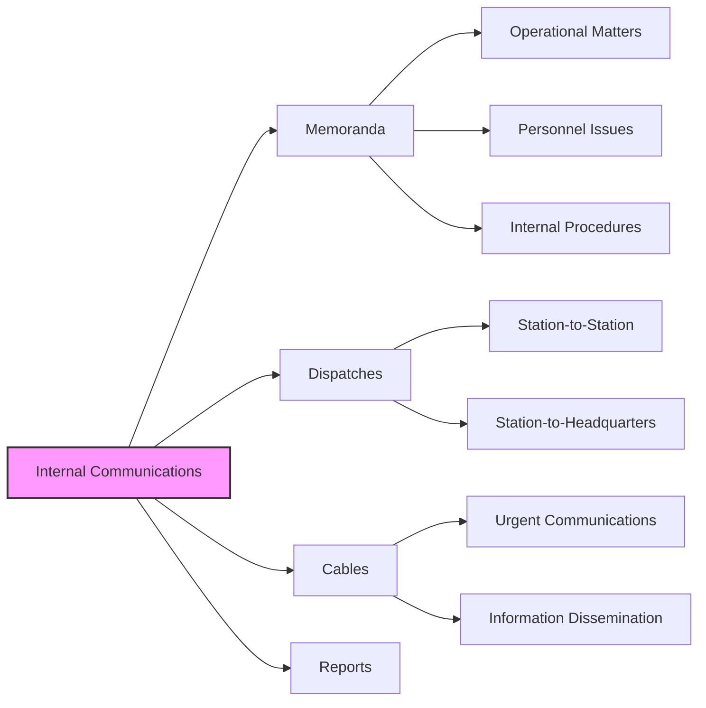

# Internal Communications

This directory contains internal CIA communications, such as memos, dispatches, and cables, that discuss operational matters, personnel, and internal procedures. These documents provide insight into the CIA's internal workings and decision-making processes.

## Mermaid Diagram

