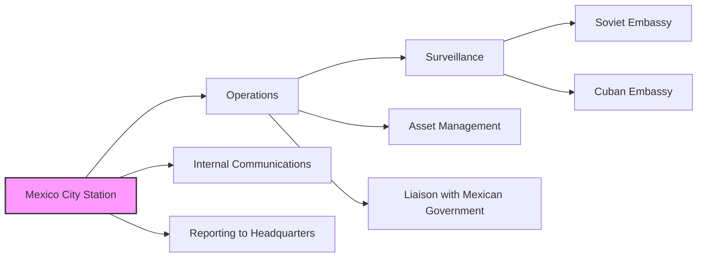

# Mexico City Station

This directory contains documents related to the CIA's Mexico City Station, its operations, and its interactions with other entities. This includes surveillance operations, asset management, and coordination with other agencies.

## Mermaid Diagram

