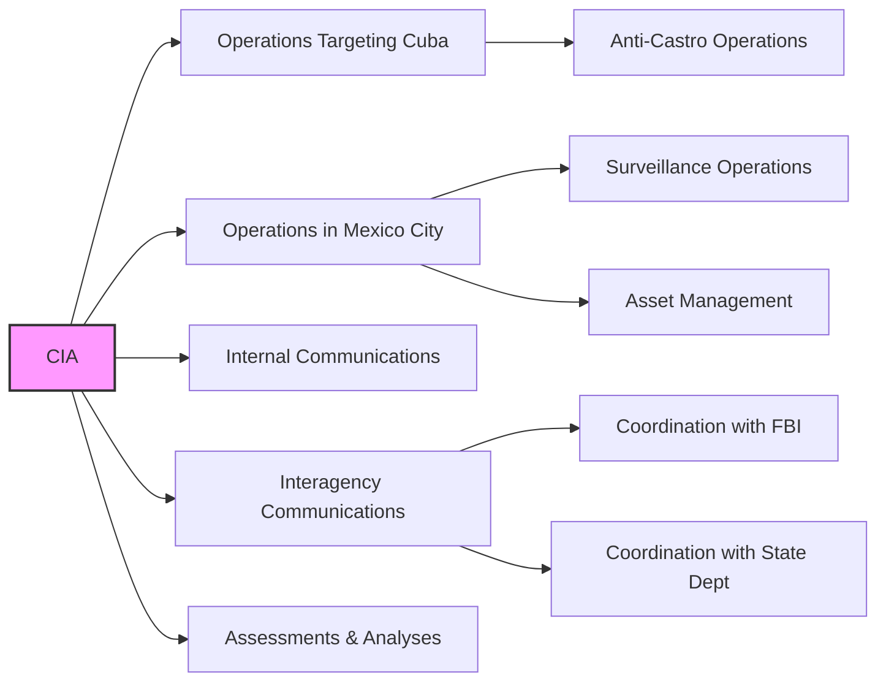

# CIA Involvement and Operations

This directory focuses on documents related to CIA activities, particularly those concerning Cuba and anti-Castro operations. It includes documents related to:

*   CIA operations in Mexico City.
*   CIA operations targeting Cuba.
*   CIA internal communications and memos.
*   CIA interactions with other agencies (FBI, State Department, etc.).
*   CIA assessments of individuals and situations.

The goal is to organize documents that shed light on the CIA's role in events surrounding the JFK assassination, either directly or indirectly.

## Mermaid Diagram

